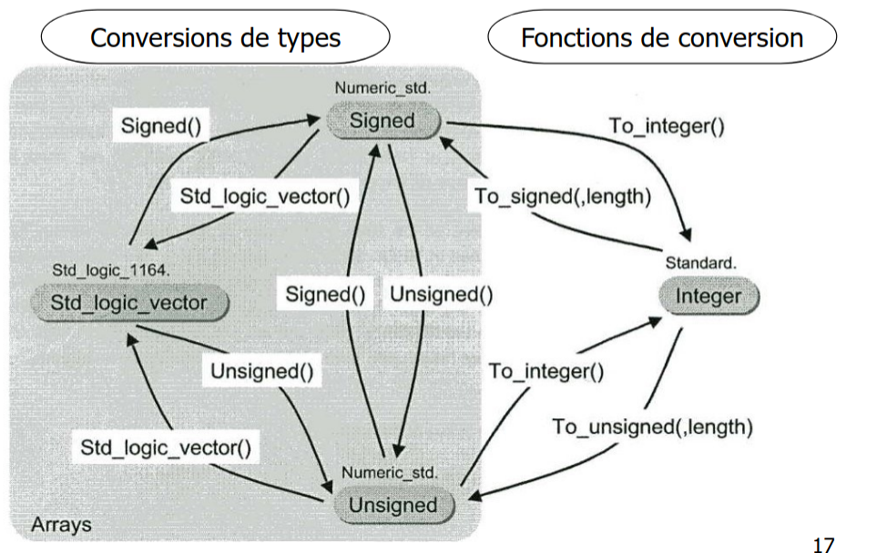

Last edited time: April 18, 2025 8:25 PM



```vhdl
entity ADDER is
port ( A,B : in STD_LOGIC_VECTOR(7 downto 0);
SUM : out STD_LOGIC_VECTOR(7 downto 0));
end entity;
architecture A1 of ADDER is
begin
SUM <= STD_LOGIC_VECTOR(UNSIGNED(A) + UNSIGNED(B));
-- ou SUM <= STD_LOGIC_VECTOR(SIGNED(A) + SIGNED(B));
end architecture;
```
