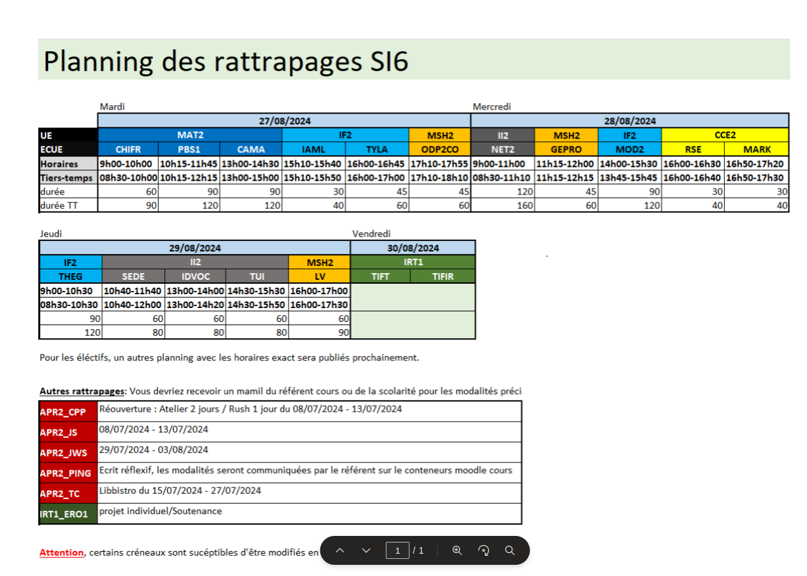

Last edited time: March 12, 2025 9:59 PM

# Semester 5

📄 [Syllabus](https://epitafr.sharepoint.com/sites/EPITAscolarites/SiteAssets/Forms/AllItems.aspx?id=%2Fsites%2FEPITAscolarites%2FSiteAssets%2FSitePages%2FPromo%2D2026%2FSyllabus%2DS5%2Epdf&parent=%2Fsites%2FEPITAscolarites%2FSiteAssets%2FSitePages%2FPromo%2D2026)

### Informatique industrielle

[[OS] Operating System](ING1/%5BOS%5D%20Operating%20System.md)

[[ASM] Assembly](ING1/%5BASM%5D%20Assembly.md)

[[NET1] Network](ING1/%5BNET1%5D%20Network.md)

### Ateliers & Projects

[[TOOL] C Compilation process](ING1/%5BTOOL%5D%20C%20Compilation%20process.md)

[[PRJ] Projects](ING1/%5BPRJ%5D%20Projects.md)

### Maths

[[HARMO] Harmonisation Maths](ING1/%5BHARMO%5D%20Harmonisation%20Maths.md)

[[CPXA] Complexity of Algorithms](ING1/%5BCPXA%5D%20Complexity%20of%20Algorithms.md)

[[MASI] Signal Mathematic](ING1/%5BMASI%5D%20Signal%20Mathematic.md)

### Informatique fondamentale

[[PFON] Functional Programming](ING1/%5BPFON%5D%20Functional%20Programming.md)

[[TYLA] Theory of Language](ING1/%5BTYLA%5D%20Theory%20of%20Language.md)

[[MOD1] Modelisation](ING1/%5BMOD1%5D%20Modelisation.md)

### Management  & sciences humaines

[[DRG1] Droit Général](ING1/%5BDRG1%5D%20Droit%20Ge%CC%81ne%CC%81ral.md)

[[DDPP] Developement durable premier pas](ING1/%5BDDPP%5D%20Developement%20durable%20premier%20pas.md)

# Semester 6

### Management

📄 [Syllabus](https://epitafr.sharepoint.com/:b:/r/sites/EPITAscolarites/SiteAssets/SitePages/Promo-2026/2026_Syllabus-S6.pdf?csf=1&web=1&e=z0jNNZ)

[[SCHD] Planning](ING1/%5BSCHD%5D%20Planning.md)

### Informatique industrielle

[[TUI] Technologie des Interfaces utilisateurs](ING1/%5BTUI%5D%20Technologie%20des%20Interfaces%20utilisateurs.md)

[[IDVOC] Initiation au DevOps](ING1/%5BIDVOC%5D%20Initiation%20au%20DevOps.md)

[[SEDE] Security of development](ING1/%5BSEDE%5D%20Security%20of%20development.md)

[[NET2] Network 2](ING1/%5BNET2%5D%20Network%202.md)

### Mathematics

[[PBSA] Probabilites et statistiques](ING1/%5BPBSA%5D%20Probabilites%20et%20statistiques.md)

[[CHIFR] Chiffrement et code correcteur](ING1/%5BCHIFR%5D%20Chiffrement%20et%20code%20correcteur.md)

[[CAMA] Calcul matriciel](ING1/%5BCAMA%5D%20Calcul%20matriciel.md)

[[STA] Algebraic structure](ING1/%5BSTA%5D%20Algebraic%20structure.md)

### Informatique fondamentalle

[[IAML] AI and Machine Learning](ING1/%5BIAML%5D%20AI%20and%20Machine%20Learning.md)

[[TYLA] Typology of Languages](ING1/%5BTYLA%5D%20Typology%20of%20Languages.md)

[[THEG] Theory of graphs (ENG)](ING1/%5BTHEG%5D%20Theory%20of%20graphs%20(ENG).md)

[[THEG] Theory of graphs (FR)](ING1/%5BTHEG%5D%20Theory%20of%20graphs%20(FR).md)

[[MOD2] Modelisation 2](ING1/%5BMOD2%5D%20Modelisation%202.md)

### Innovation, research and technical deepenig

[[ERO1] Element de recherche operationelle](ING1/%5BERO1%5D%20Element%20de%20recherche%20operationelle.md)

[[KERN] Project K](ING1/%5BKERN%5D%20Project%20K.md)

[[CPPA] Advanced C++](ING1/%5BCPPA%5D%20Advanced%20C++.md)

[Parallel Programming](ING1/Parallel%20Programming.md)

[Quantum Computing](ING1/Quantum%20Computing.md)

### Culture et entreprise

[[M_SST] Mooc Sécurité et Santé au Travail](ING1/%5BM_SST%5D%20Mooc%20Se%CC%81curite%CC%81%20et%20Sante%CC%81%20au%20Travail.md)

[[REPP] Projet Professionnel](ING1/%5BREPP%5D%20Projet%20Professionnel.md)

[[MARK] Marketing](ING1/%5BMARK%5D%20Marketing.md)

[[RSE] Responsabilité Sociétale de l’Entreprise](ING1/%5BRSE%5D%20Responsabilite%CC%81%20Socie%CC%81tale%20de%20l%E2%80%99Entreprise.md)

### Managment et sciences humaines

[[GEPRO] Gestion de projet](ING1/%5BGEPRO%5D%20Gestion%20de%20projet.md)

[[CPT] Conception](ING1/%5BCPT%5D%20Conception.md)

[[ODP2CO] **Développement des soft skills de collaboration**](ING1/%5BODP2CO%5D%20De%CC%81veloppement%20des%20soft%20skills%20de%20collabo.md)

### Ateliers & Projects

[[COMP] Compilers](ING1/%5BCOMP%5D%20Compilers.md)

[[PING] Projet de fin d’ING1](ING1/%5BPING%5D%20Projet%20de%20fin%20d%E2%80%99ING1.md)

