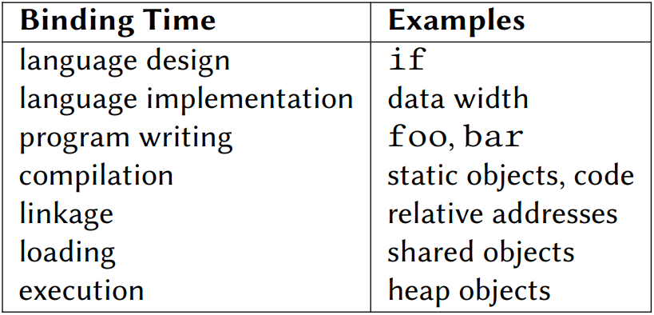

Last edited time: April 2, 2024 1:46 PM

## Binding rough definition

Process of linking identifiers to objects

# Binding Times



## Static (early) Binding

The compiler statically (at compile time) associates an identifier to some definition

Example : in C, when we call foo we know where to find its definition

## Dynamic Binding

The compiler needs to add code that identifies the kind of object at runtime then matches the identifier with the definition (for example function call)

Example : virtual in C++ we don’t where the definition of foo is, we need to find the right implementation


## In Tiger

- Design Keywords
- Program Identifiers
- Compile Function code, frames, types
- Execution Records, arrays addresses

There is very little dynamic behavior

# Binder


Link the usages to the definition.

### Example

```jsx
let var a := 42 in a := 51 end
```


## If multiple definitions

```fsharp
let var a := 42 
in
	let var a := 51
	in
		a
	end;
	a
end
```

We take the one from the current scope:

- 1rst a → def line 3
- 2nd a → def line 1

<aside>
💡 For each scope we are gonna define a set of binding called an environment

</aside>

### Example

```fsharp
structure M = struct
	structure E = struct
		val a = 5;
	end
	structure N = struct
		val b = 10;
		val a = E.a + b;
	end
	structure D = struct
		val d = E.a + N.a;
	end
end
```

$\sigma_0=\ Prelude\\
\sigma_1=\{a:int\}\\
\sigma_2=\{E:\sigma_1\}\\
\sigma_3=\{b:int,\ a:int\}\\
\sigma_4=\{N:\sigma_3\}\\
\sigma_5=\{d:int\}\\
\sigma_6=\{D:\sigma_5\}\\
\sigma_7=\sigma_2+\sigma_4+\sigma_6$

$\sigma_0+\sigma_2+\sigma_4+\sigma_6\ \vdash\ M:\sigma_7$

We need to observe what’s inside an environment to define it, that’s why we do $\sigma_1$ before $\sigma_2$

# Symbol Table

<aside>
⚠️ Careful the name is misleading → maintains a **stack** of environment

</aside>

Used to know the current environment and maintain it

The binder is gonna use and build the symbol table progressively to be able to build the threaded AST

It is easy to maintain if you don’t have scopes or all identifier are unique

→ identifier is a key and node definition is the value

### Environment

We use a simple **hashtable** to represent an environment

A FullLookup is costful $\Rightarrow$ when entering scope we add a **copy** of the latest env

### Example

```fsharp
let var a := 42
in
	let var b := 51
	in
		a + b
	end;
	a
end
```

[ezgif-2-09b524c29d.apng](Binder/ezgif-2-09b524c29d.apng)

### Scoped Symbol Table

```fsharp
template <typename Entry_T>
class Table
{
public:
	Table();
	auto put(symbol key, Entry_T& val) -> void;
	auto get(symbol key) const -> Entry_T*;
	auto scope_begin() -> void;
	auto scope_end() -> void;
	auto print(std::ostream& ostr) const -> void;
};
```

## Main idea

- Start with an empty environment
- When entering a scope add a **copy of the latest** environment
- For each declaration, add the identifier to the **latest** environment
- For each use, link to the latest declaration among **all** environments
    
    $\Rightarrow$ Build here the threaded AST
    
    $\Rightarrow$ The environment handles references to AST nodes rather than types
    
- Remove the last environment at the end of the scope
