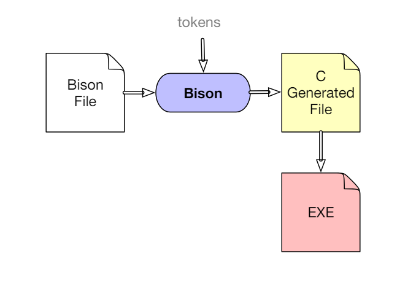

Last edited time: March 12, 2024 10:22 AM



Bison → based on token

### Typical Bison file:

```jsx
%{
[pre-code C (nec. def.)]
%}
[definitions and options]
%%
[production rules]
%%
[post-code C (subprograms)]
```

### Production Rule:

```jsx
non-terminal:
seq. of symb. { /*C*/ }
| another seq. { /*C*/ }
| ... ;
```

C-code is optional and is only executed when the rule is reduced

## Rules of reduction

### LALR-1 – Default

When a conflict occurs:
- reduce/reduce: reduce to the first rule in conflict
- shift/reduce: performs the shift

### GLR

During a conflict the parser walks the two branches hoping that one of the two will win.
Maintains multiple parse stacks
Allows ambigous grammars
