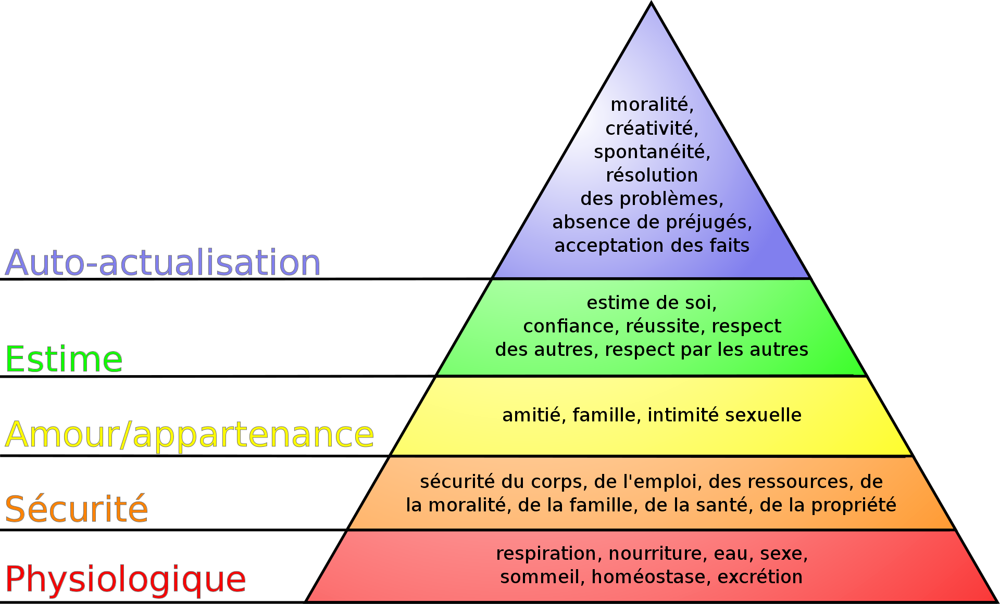

Last edited time: May 14, 2024 5:42 PM

# Overview

Telling stories is a great way to get in touch with people. You need to adapt the story based on the audience.

If you know how to take your audience in a journey that matches their need, you’ll easily convince them.

Storytelling is not a casual conversation. We aim to captivate the audience by surprising, choking them. Anyway, we need to generate emotion and reaction in the audience.

There is 5 steps in building a story:

1. Initial situation
2. Perturbations
3. Incidents
4. Outcome
5. Resolution

<aside>
⚠️ Avoid resolving any uncertainty in the story.
Avoid telling too much about characters or making them too simple.
Avoid having too long stories.

</aside>
