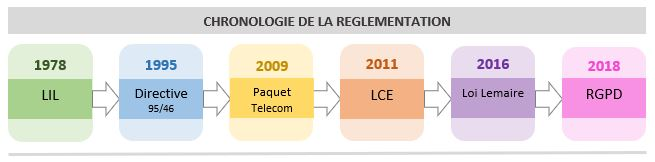

Last edited time: January 9, 2024 3:07 PM

1974 : Scandale du projet SAFARI

→Creation du CNIL (Commission nationale de l'informatique et des libertés)

14/04/2016 : Adoption du RGDB

06/01/1978 : LiL (Loi informatique et Liberte)

Principe de la LiL

