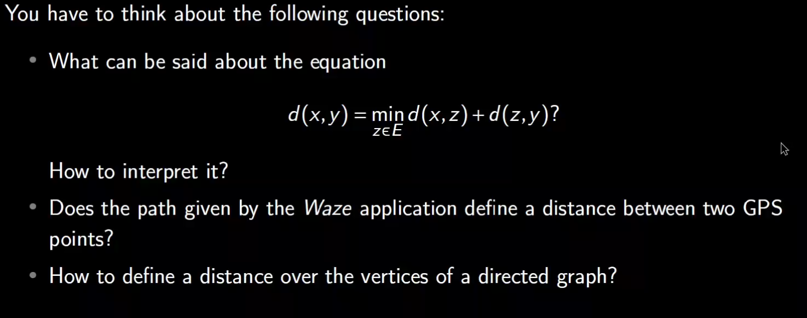

Last edited time: September 4, 2023 11:04 PM

# Intro

[Slide 1 [en] - Metric spaces.pdf](Distance/Slide_1_en_-_Metric_spaces.pdf)

Some functions of the real variable are difficult to study. A new approach is to replace the function by a sequence that approximates. The sequence will get closer and closer to the value we are looking for.

**Definition of a sequence Un converging to l**

$$
\forall \epsilon > 0,\exist N \in \N:n\geq N \implies |U_n-l| < \epsilon
$$

## Distance

- A distance between two elements of E is a funciton over ExE with positivie values
- A distance between an element and itself is zero
- The distance a - b is the same as the distance b - a
- *dist*(a,c) ≥ *dist*(a,b) + *dist*(b,c)
    
    
    

## Exercice

- if z is between x and y, d(x,y) = d(x,z) + d(z,y).
- Yes it does because it provides a path between two points and the distance can be represented as the time to get from A to B.
At the same time, it doesn’t because a distance is the measure from point A straight to point B. There is no turning allowed in distance.
- A distance over the vertices of a directed graph is the set of edges that has the smallest cost and let us go from point A to point B in a valid sequence.
