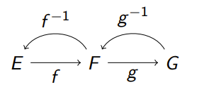

Last edited time: September 21, 2023 2:01 PM

# Introduction

> A function takes an input of a given type and returns a
single value of another (possibly different) type.
> 

## Partial function

Given two sets E and F, a partial function is a subset f ⊆ E × F (also written f : E ⇀ F)  such that ∀x ∈ E, there exists at most one y ∈ F such that (x, y) ∈ f .

We then write y = f (x); x is an antecedent of y, and y, the image of x

<aside>
💡 The set {(x, y) ∈ R²| x = y²} is not a function, as a single antecedent can have two images.

</aside>

## Domain

The subset Dom(f ) = {x ∈ E | ∃y ∈ F,(x, y) ∈ f } of E is called the domain of a partial function f : E ⇀ F.

## Function

A partial function f : E ⇀ F is said to be an **application** or simply a **function** if Dom(f ) = E. Then we write f : E → F.

<aside>
💡 The set of all functions E → F is written F^E

</aside>

## Image

The subset Im(f ) = {y ∈ F | ∃x ∈ E,(x, y) ∈ f } of F is called the image of a partial function f : E ⇀ F.

<aside>
⚠️ the notation f : E → F does not mean that F = Im(f ).
**exemple:** Consider exp : R → R. Then Im(exp) = R*+

</aside>

# Properties of functions

## Composition

Given two functions f : E → F and g : F → G, there exists an unique function g ◦ f : E → G such that ∀x ∈ E, g ◦ f (x) = g(f (x)).

> **Associativity law**
Consider three functions f : E → F, g : F → G, and h : G → H. Then (h ◦ g) ◦ f = h ◦ (g ◦ f ). We say that the operator ◦ is associative.
> 

## Injective functions

> **f(x) = f(y) ⇒ x = y**
> 

<aside>
⚠️ Note that a function may match the same image to two different antecedents.

</aside>

We thus consider the following definition:
A function f : E → F is said to be **injective** if and only if ∀x, y ∈ Dom(f ), f (x) = f (y) ⇒ x = y.

## Surjective functions

> **∀y ∈ F, ∃x ∈ E, y = f(x)**
> 

<aside>
⚠️ Conversely, an element of a function’s destination set may admit no antecedent

</aside>

A function f : E → F is said to be **surjective** if and only if ∀y ∈ F, ∃x ∈ E, y = f (x).

# Bijection

A function f : E → F is said to be **bijective** if and only if f is ***injective and surjective***.

> The sets E and F are then said to be equipotent.
> 

$$
 f ◦ f^{−1} = Id_F\\
f^{−1} ◦ f = Id_E
$$

With f^-1 being unique

<aside>
👁️ Consider two bijections f : E → F and g : F → G. Then g ◦ f : E → G is
a bijection as well.

</aside>

