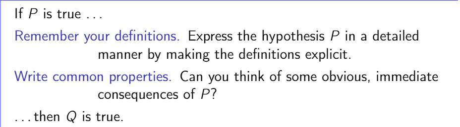

Last edited time: September 6, 2023 2:33 PM

# Definition

**Proposition:** merely statements to which we match a truth value

<aside>
🧠 A proposition is **ALWAYS** either TRUE or FALSE

</aside>

# Connectors

| Representation | Meaning |
| --- | --- |
| ^ | AND |
| v | OR |
| **¬** | NOT |
| ⇒ | IMPLIES |

# Pattern

<aside>
💡 We might start a proof by the keyword “Let”

</aside>

## P ⇒ Q

Goal: proof that P implies Q is TRUE

### Exemple

Prove that n in N is evene ⇒ n² is even

Let n in N be an even integer

There exists k in N such that n = 2k

Thus n² = 4k² = 2 * 2k², hence, n² is even 

## P ⇒ (Q^R)

Suppose P is true

Split a complex goal into sub goals

**Sub goal 1. Prove P**

**Sub goal 2. Prove R**

# Slides

[folo_slides_0_handout.pdf](Introduction/folo_slides_0_handout.pdf)

[folo_slides_1_students.pdf](Introduction/folo_slides_1_students.pdf)
