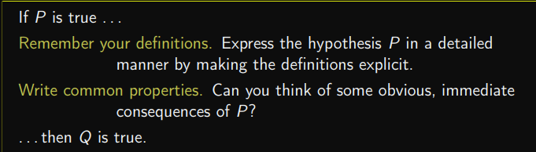

Last edited time: September 21, 2023 1:59 PM

# Basics

## P ⇒ Q y

<aside>
💡 (P ⇒ Q) ⇐⇒ (¬Q ⇒ ¬P)

</aside>

## P ⇒ (Q ^ R) y

## (P ^ Q) ⇒ R

 

## P ⇒ (Q v R)

## (P v Q) ⇒ R y

 

## P ⇐⇒ Q y

# Sets

## A ⊆ B y

## A = B y

## E = ∅ y

# Quantifiers

## ∀x ∈ E, P(x)

## P ⇒ (∀x ∈ E, Q(x)) y

## ∃x ∈ E, P(x) y

## (∃x ∈ E, P(x)) ⇒ Q

## P ⇒ (∃x ∈ E, Q(x)) y

## ∃!x ∈ E, P(x)

# Equivalence relation

## R is an equivalence relation on E.

## P is a partition of E

## E/≡R is a partition of E

# Functions

## the relation f is an application (function) E → F.

## f is injective

## f is surjective

## f is bijective

