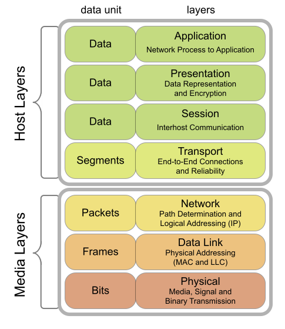

Last edited time: May 30, 2024 5:21 PM

# Overview

A “device” represents any physical or virtual entity that is capable of performing a specific function or task.

<aside>
🧠 It is meant to be a very general term

</aside>

## Link with the OSI model

To build a packet, we refer to the OSI (Open Systems Interconnection) Model. It is a model that splits the creation of an information meant to be sent over a network into several “Layers”. Each layers is responsible for one thing only.

The three media layers can be associated with:

- **Network**: routers
- **Data link**: switches
- **Physical**: underground wires

<aside>
⚠️ While it is generally true, a strict equality between those devices and the layers **cannot** be made.

</aside>

# Physical interface

A physical interface can be seen as a physical device that aims to send data over the internet. For example, it is common to have 2 main physical interfaces in your computer:

- your wifi device
- an ethernet access device

<aside>
🧠 Even if the ways of sending data (waves, wires…) can differ, the aim of the physical interface is always the same: send data over a network.

</aside>

<aside>
💡 A physical interface is associated with a unique [MAC Address](MAC%20Address.md).

</aside>

# LAN Switching

A switch is a device that acts as an intermediate between 2 or more other devices. It can be seen as an “**intelligent wire**” and do **NOT** possess any MAC address.

<aside>
🧠 [Check out this other page](../../%5BNET1%5D%20Network/Network%20components/Switch.md) to further understand switches

</aside>

A switch keeps basically track of a simple table matching every MAC address with one port (it is called a *MAC address table*). 

In order to leran what address is linked to what port, the switches:

- stores the mac address and the associated port whenever a machine emits a frame for the first time
- broadcasts to every port any packet that aims to reach an unknown MAC address (except the one where it comes from, obviously)
    
    <aside>
    🧠 Broadcast may also happen if the table is full (MAC flooding attack), or for some
    destination addresses (broadcast on ff:ff:ff:ff:ff:ff), or for some other devices (hubs, WiFi hotspots . . .).
    
    </aside>
    

# Routers

Routers address the issue of always increasing networks. As internet grew more and more, eventually the [IP protocol](IPv4%20protocol.md) was not enough to keep track of all the devices interconnected.

The router was then made to face this issue: it subdivides the problem in smaller problem easier to solve, or in this context, in sub networks.

In essence, a router can be described as any machine connected to two (or more) networks willing to transmit packets from one network to another.

Since a router is connected to several networks, it obviously need several physical devices.

A routing table is then, a bit more complex than the one seen for the switches… It obeys to some rules:

- Interface and source IP need to be filled only for local networks;
- If two rules apply, use the most specific one;
- Two rules are as specific, use the one with the smallest metric;
- **default** is a shortcut for 0.0.0.0/0, sometimes called gateway

<aside>
🧠 All routers need a **default** route. This default route often redirects to another router.

</aside>

### Example

### Routing summary

- Routing is fast but computing routing tables is slow (BGP protocol, not discussed here
- Subnetting: complex if we want to optimize used addresses ⇝ less granularity
- IP addresses are globally unique ressources assigned by a central authority
