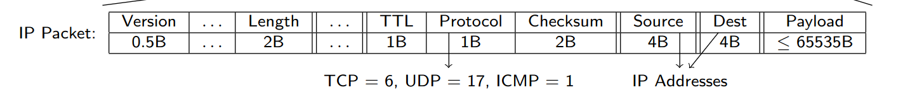

Last edited time: May 28, 2024 3:50 AM

# Overview

- Source is before Destination
- Checksum is computed without the header part but rather uses only the payload.
    
    <aside>
    💡  a checksum is a value computed from data to detect errors or ensure data integrity during transmission or storage
    
    </aside>
    
- IP protocol is not correlated to [Ethernet Frames](Ethernet%20Frame.md):
    - IP maximum payload is larger than Ethernet maximum payload. If the payload is too large, the IP payload will be sent as several [Ethernet Frames](Ethernet%20Frame.md).
    - IP Packets may be carried by other protocols than Ethernet
