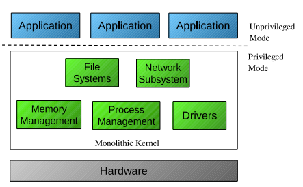

Last edited time: November 3, 2024 3:32 AM

# Definition

In simpler terms, a kernel is like the boss of your computer's operating system. It:

1. Manages your computer's hardware (like the CPU, memory, R/W IO devices, scheduling, security).
2. Keeps different programs from fighting with each other for resources.
3. Provides a safe and organized way for programs to talk to your computer's hardware.
4. Makes sure your computer stays secure and doesn't crash.
5. etc…

Think of the kernel as the "traffic cop" that keeps everything running smoothly in your computer.

<aside>
💭 **Definition:** The part of code always resident in memory/always running.

</aside>

The remainder of the operating system is called **system programs**.

# Communication

[Communication Kernel / Program](Kernel/Communication%20Kernel%20Program.md)

[Standards](Kernel/Standards.md)

# Structures and components

[Process](Kernel/Process.md)

[Security](Kernel/Security.md)

[Scheduler](Kernel/Scheduler.md)

# Memory

[Filesystem](Kernel/Filesystem.md)

[File Signatures](Kernel/File%20Signatures.md)

[RAM management](Kernel/RAM%20management.md)

[Long-Term Storage](Kernel/Long-Term%20Storage.md)

# Types of Kernel

## Monolithic

A monolithic kernel is a type of operating system kernel that combines the functionality of various system components into a single, large, and cohesive unit. In a monolithic kernel, the core operating system services, device drivers, file system management, and other essential functions all run together as a single program in kernel mode

- All core operating system functions and services are tightly integrated into a single kernel program.
- Device drivers and system services are part of the same kernel space.
- Communication between kernel components is efficient but lacks modularity.
- Examples of monolithic kernels include older versions of Windows (e.g., Windows 95 and Windows 98) and Linux.

## Micro

- Micro kernels keep the core functions of the operating system small and minimal.
- Most device drivers and system services run as separate processes in user mode, outside the kernel.
- Micro kernels aim to be more modular, allowing for easier extensibility and system stability. However, they may have some performance overhead due to inter-process communication.

## Other types

**Hybrid Kernel**:

- Hybrid kernels aim to strike a balance between monolithic and microkernel designs.
- They include a small, efficient kernel with critical functions while running some device drivers and services in kernel mode for performance reasons.
- The user mode still contains many non-critical components.
- Examples of hybrid kernels include Microsoft Windows NT and macOS.

**Modular Kernel**
A modular kernel is like a Lego set for your operating system. Instead of having all the pieces glued together, the core part is small, and you can snap on extra pieces when needed. These extra pieces are like device drivers or additional features. You can attach them while your computer is running, which is like adding new functions without rebuilding the whole system. It's flexible and efficient!
