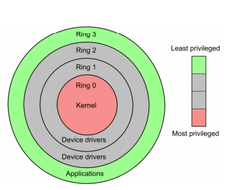

Last edited time: December 17, 2023 8:33 PM

# Hardware

Hardware supports **security mechanisms**

## Privilege level

Imagine computer security like a building with different security levels

Rings represent different levels of access or privilege in a computer. The lower the ring, the less control and access you have. It's a way to keep the most critical parts of the computer (kernel) safe and separate from regular programs.

<aside>
💡 Rings 1 and 2 are mostly not used

</aside>

- **User Mode** (Ring 3): This is the "Guest" mode. In User Mode, regular programs, like web browsers and games, run. They don't have full control over the computer and can't talk directly to hardware. Instead, they have to ask the "Boss" (Kernel Mode) for permission to do things like access files, use the printer, or connect to the internet.

- **Kernel Mode** (Ring 0): This is the "Boss" mode. In Kernel Mode, the computer's core operating system has full control over everything. It can do anything, including talking directly to hardware. This mode is like a super-secure area, and only the most trusted parts of the operating system get to be here.

While user mode programs have access to a part of RAM, they are confined to their own "sandbox" within the memory, and they cannot directly access the entire RAM or the system's critical memory areas that are reserved for the operating system in kernel mode.

# Error in kernel

In case of an error in the kernel, the kernel doesn’t always crash. It depends on the type of the kernel and the error.

For example, if the kernel tries to divide by 0 at any time, the kernel can survive this kind of error.

With that being said, [Monolithic kernels](../Kernel.md) are the most vulnerable to this kind of error.
