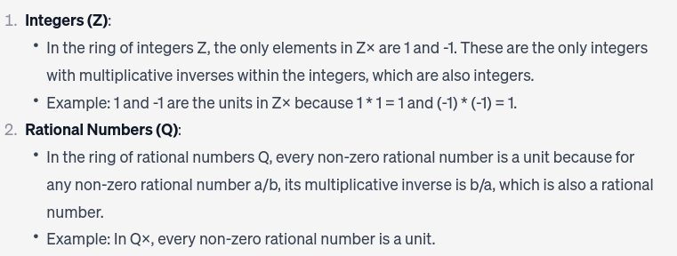

Last edited time: November 12, 2023 4:00 PM

## Partial Order

- reflexive
- anti-symmetric
- transitive

### Unit (Invertable elements)

$$
\text{In a ring A we denote by} \ A^X\ \text{ the set of invertible elements of A,} \\
\text{sometimes also
called units.}
$$

- examples of units
    
    
    

$$
\text{to find the units/invertable elements of any } \mathbb{Z}/n \mathbb{Z}, \\ \text{it is equvalent to finding all the integers, x, such that :} \\
GCD(x,n)=1

$$

|  | Semi-group | Monoid | Group | Alebian | Ring | Commutative Ring | Ring w\1 | Division Ring | Integral domain | Field |
| --- | --- | --- | --- | --- | --- | --- | --- | --- | --- | --- |
| Closure  | *         cl | *    cl | *  cl | *    cl | **·cl    +** | **·**       cl    **+** | **·  cl**    **+** | **·**      cl  **+** | **·   cl     +** | **·    cl  +** |
| Associativity | *          a | *    a | *         a | *  a | **·   a  +** | **·**   a    **+** | **·**    a    **+** | **·**  a    **+** | **·  a    +** | **·  a   +** |
| Identity  |  | *   id | *   id | *         id |  **id      +** | **·**     id  **+** | **·**  id     **+** | **·**   id    **+** | **·   id  +** | **·  id +** |
| Inverses |  |  | *   inv | *  inv |  **inv  +**     |   **** inv        + |  inv     **+** | **·**      inv  **+** | **inv    +**     | **· inv +**    |
| Commutativity |  |  |  | *    cm |   cm  **+** | **·**  cm      **+**  |     cm        + | cm       | **·**  cm     +            | **·**  cm   **+** |
| Distributive |  |  |  |  | **·** d    **+** | **·**  d    **+** | **·**   d   **+** | **·**  d    **+** | **·  d**   **+** | **·**  d   **+** |
| Unique Mult id  |  |  |  |  |  |  **·**  idu | **·      idu** |  **·** idu |     idu | **·  idu** |
| No Zero Divisors |  |  |  |  |  |  |  | **·   zd**                      | **· zd** | **· zd** |

f

### TYPES OF RINGS

### Ring w\1

- unique multiplicative identity is 1

### Commutative ring

- ab = ba

### Integral Domain (commutative, ring w\1)

- no zero divisors (i.e. ab = 0 ⇒ a = 0 or b = 0)

### Division Ring (ring w\1)

- all nonzero element have an inverse

### Field (integral domain, division ring, commutative ring, ring w\1)

- commutative ring and division ring
