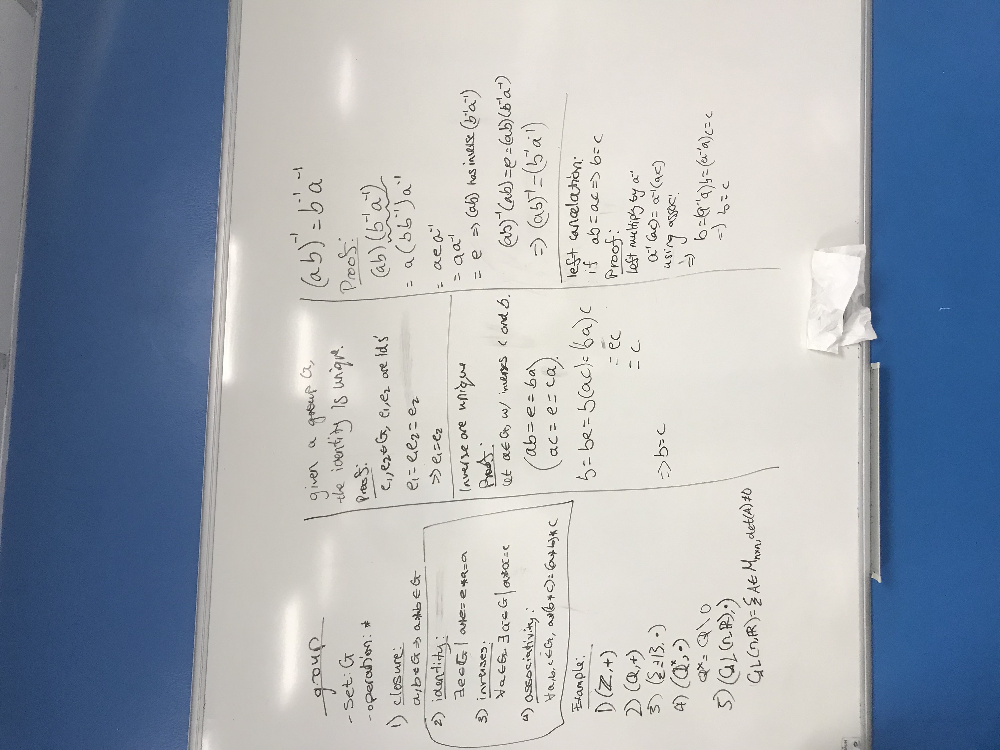

Last edited time: January 23, 2024 11:50 PM

# Group

$G$ a set equipped with a binary operation written $*$. Then  ($G,*$) is a group if:

1. **closure** ($H$ stable for *) $\forall a,b\in G, a*b\in G$  
2. $*$ admits a **neutral element $\Longrightarrow \ \exists e\in G\ |\ \forall a\in G, a*e=e*a=a$**
3. $*$ is **associative $\Longrightarrow \ \forall a,b,c\in G, a*(b*c)=(a*b)*c$**
4. $*$ is **invertible** $\iff \forall a\ \in G,\exist b\in G\ |\ a*b=b*a=e$

## Abelian Group

$(G,*)$ is abelian if $*$ is **commutative**

[Abelian Group Properties](Groups/Abelian%20Group%20Properties.md)

## Sub-Group

$(G,*)$ a group of neutral element $e$, $H \subset G$ , $H$ is a sub-group of $G$ for $*$ if :

- $\forall g,h \in H, g*h\in H$   →  $H$ is stable by *
- $\forall g \in H$, $g^{-1} \in H$
- $e\in H$

<aside>
💡 $(H,*)$  is a group
You can just prove that : $\forall g,h\in H, g*h^{-1}\in H$

</aside>

### Examples:

The subset $\ \forall n \in \mathbb{Z}, n\mathbb{Z} ⊂ \mathbb{Z}$  is a subgroup of $(Z, +)$.
The subset of squares in $\mathbb{F}^*_q$ is a subgroup of $(\mathbb{F}^*_q, \times)$
The subset of upper triangular matrices in  $GL_n(K)$  is a subgroup of $(GL_n(K), ×)$.

## Cyclic subgroup

The cyclic subgroup generated by an element $x\in G$ of a group $(G,\cdot )$ is $H=\{x^k\ |\ k\in \mathbb{Z}\}$. 

## Order of an element

Let $(G,\cdot )$ be a group with neutral element $e$ and $x\in G$ with $x\neq e$. The order of $x$ is 

$$
⁍
$$

If $\nexists m\Rightarrow ord(x)=+\infty$

<aside>
 The order of $x$ is the smallest integer $m > 0$ for which $x^m = e.$

</aside>

### Proposition

Let $(G, ·)$ be a group with neutral element  $e, x ∈ G$ of order $m$, and $E$  the subgroup of $G$ generated by $x$.
• If $m = ∞$, then  $H = \{ x^k\ | \ k ∈ \mathbb{Z} \} = \{ . . . , x^{−2}, x^{−1}, e, x, x^2, . . . \}.$
• If  $m \neq ∞$, then $H = \{ e, x, x^2, . . . , x^{m−1}\}$ with all these powers distinct

[Group Morphism](Groups/Group%20Morphism.md)

[Group Action](Groups/Group%20Action.md)

[Symmetries](Groups/Symmetries.md)

