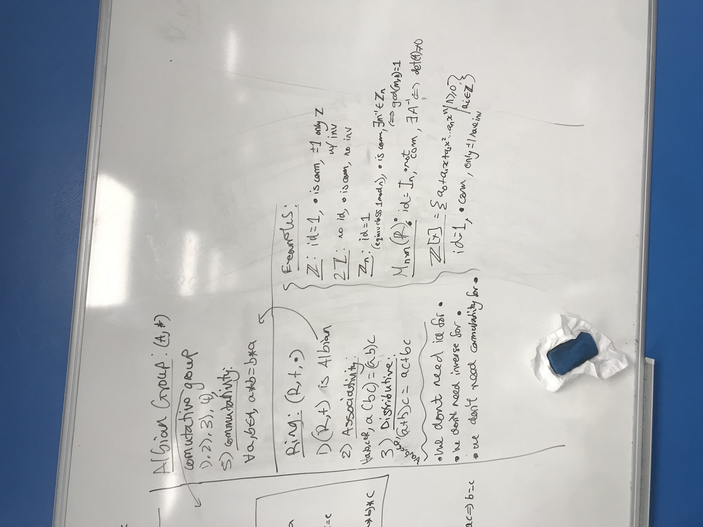

Last edited time: November 13, 2023 10:09 AM

# Ring

$A$ a set equipped with 2 binary operation + and  $*$. Then  $(A,+,*)$ is a ring if :

- $(A,+)$  is an abelian group
- $*$ has a neutral element $1_{A}$
- $*$ is associative
- $*$ is distributive on +

<aside>
 $(A,+,*)$ is commutative if $*$ is commutative

</aside>

**Classical examples :**

$(\mathbb{Z},+,*),\ (\mathbb{Q},+,*),\ (\mathbb{R},+,*),\ (\mathbb{C},+,*),\ (\mathbb{R^\mathbb{N}},+,*)$ are rings

If $E$ is a set and $A$ a ring then : $(\mathcal{F}(E,\mathbb{R}),+,\times)$ and $(\mathcal{F}(E,A),+,\times)$ are rings

A singleton is always a ring

## Calculus rule in a ring

$(A,+,*)$ a ring, $a,b\ \in\ A$  and $n\ \in\ \mathbb{Z}$, then :

- $a*0_{A}\ =\ 0_{A} * a\ =\ 0_{A}$
- $-(a,b)\ =\ -(a)b\ =\ a(-b)$
- $n(ab)\ =\ (na)b= a(nb)$
- $(-a)(-b)\ =\ ab$
- $ab\ =\ ba\$ $\Rightarrow\ \forall p\ \in\ \mathbb{N},\ (ab)^p\ =\ a^pb^p$

### Unit group

$(A,+,\times)$ a ring, the unit group of $A$ is :

$A^\times=\{a\in A,\ \exist b\in A,\ ab=ba=1_A\}$ 

It is the set of all the invertible elements of $A$ for the multiplication

## Division Ring

$(A,+,\times)$ a ring, it is a division ring if :

$\forall a\in A\backslash\{0_A\},\ \exist !b\in A\ |\ ab=ba=1_A$

It is a ring where all the ***non null elements*** are ***invertible*** and have a ***unique inverse*** for ***$*$***

## Integral Domain

$(A,+,\times)$ is an integral domain if :

- (A,+,x) commutatif unitairy (diff null ring)

$\forall a,b\ \in\ A,\ ab\ =\ 0_A\ \Rightarrow\ a\ =\ 0_A$ or $b\ =\ 0_A$

i.e. there is no divider of 0

## Sub-ring

$(A,+,\times)$ a ring and $B\subset A$,  $B$ is a  subring of $A$ if :

- $B$ is stable by product,  i.e.  $\forall b,b'\ \in\ B,\ b\times b'\ \in\ B$
- $(B,+,\times)$ is a ring

## Characterization of a sub-ring

$(A,+,\times)$ a ring,  $B\subset A$, then $B$ is a subring of $A$ if and only if :

- $1_A\in B$
- $\forall b,b'\in B,\ b-b'\in B$
- $\forall b,b'\in B,\ bb'\in B$

The subrings of $\mathbb{Z}$ are $\{0\}$ and $\mathbb{Z}$ itself

---

# Definition

In mathematics, a "ring" is a fundamental algebraic structure that consists of a set equipped with two binary operations: addition and multiplication. To check if a set with these operations forms a ring, you need to verify that it satisfies certain axioms and properties. Here are the key criteria for a set with addition and multiplication to be a ring:

1. Closure under Addition and Multiplication:
    - For all a and b in the set, a + b and a * b must also belong to the set. In other words, addition and multiplication must be closed operations on the set.
2. Associativity:
    - Both addition and multiplication must be associative operations. This means that for all a, b, and c in the set:
        - (a + b) + c = a + (b + c) for addition.
        - (a * b) * c = a * (b * c) for multiplication.
3. Commutativity of Addition:
    - Addition must be commutative. For all a and b in the set, a + b = b + a.
4. Existence of an Additive Identity:
    - There must be an element in the set, typically denoted as 0, such that for any element a in the set, a + 0 = a.
5. Existence of Additive Inverses:
    - For every element a in the set, there must exist an element -a (the additive inverse of a) in the set such that a + (-a) = 0.
6. Distributive Property:
    - The ring must satisfy the distributive property, which relates addition and multiplication. For all a, b, and c in the set:
        - a * (b + c) = (a * b) + (a * c) and (b + c) * a = (b * a) + (c * a).

## Well known cases

- Z / nZ is a ring (*not always commutative tho*)

# Types of ring

## Commutative rings

Rings can be further classified into different types, such as commutative rings (where multiplication is commutative) and non-commutative rings.

Additionally, if a commutative ring has a multiplicative identity (an element denoted as 1 such that for any element a in the set, a * 1 = 1 * a = a), it is referred to as a **commutative ring with unity** or a ring with identity.

## Division Ring

A division ring is a set equipped with two binary operations (addition and multiplication) where every nonzero element has a multiplicative inverse, making it a ring in which division is possible for all nonzero elements.

## Integral Domain

An integral domain is a commutative ring where multiplication is commutative and it has no zero divisors, meaning that if a * b = 0, then a or b (or both) must be equal to 0.

**Example of an Integral Domain:**

The set of integers (ℤ) is an integral domain. It is a commutative ring where both addition and multiplication are commutative, and there are no zero divisors. In other words, if you multiply two integers and the result is 0, then at least one of those integers must be 0. For example, if a * b = 0, then either a or b (or both) must be 0.

**Example of a Ring That Is Not an Integral Domain:**

For example, in ℤ/6ℤ:

- 2 * 3 = 0, where neither 2 nor 3 is equal to 0. This shows that ℤ/6ℤ has zero divisors, and therefore, it is not an integral domain.

