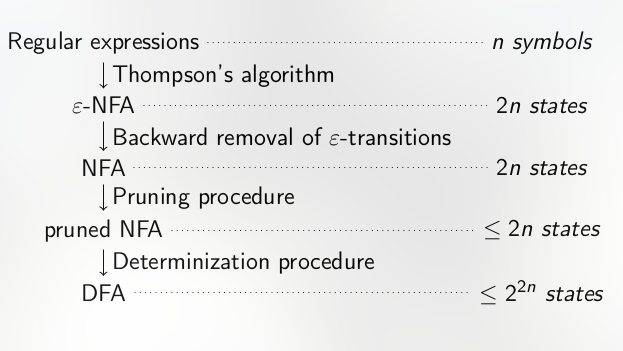

Last edited time: October 26, 2023 3:10 PM

## Finite Automata *A*

- five components
    - finite Q states
    - finite alphabet Σ
    - edges δ ⊆ Q × Σ × Q
    - A set of initial states I
    - A set of accepting states F (final)
- e then write A = (Q, Σ, δ, I , F ).

## Properties

### Determinism

- exactly one initial state
- there is from all states at most one outgoing edge labelled by a when a in Σ
- called a DFA
- **this means there is only one path per accepting word**
- allows us to check if a word is accepting linearly with the size of the input

Theorem: 

If an automaton A is deterministic, then for each word w in Σ∗ there is at most one path labelled by w .

Theorem: 

Given a NFA, *A* on an alphabet Σ, there exists an equivalent DFA, *A′* on Σ.

### Completeness

- A is complete if for all letters **a** ∈ Σ and all states **q** ∈ A, there exists at least one outgoing edge labelled by **a.**
- **TEST**
    - make it complete
        
        we add a sink state that is not accepting with a self loop. then add the missing edges towards it
        
        
        
    
    
    
- this ^ completion algorithm can be applied to any finite automata

[NFA and Thompson](Automata/NFA%20and%20Thompson.md)

[Pumping lemma](Automata/Pumping%20lemma.md)

[Moores Minimizing algorithm](Automata/Moores%20Minimizing%20algorithm.md)
