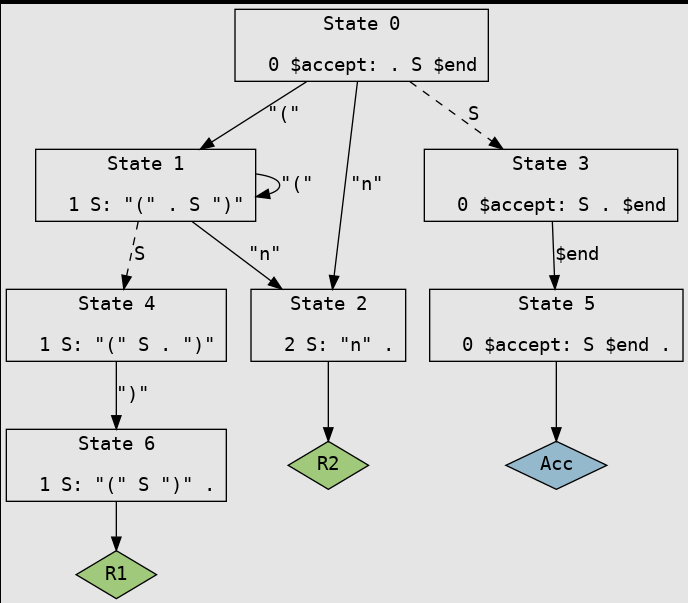

Last edited time: January 24, 2024 1:08 AM

# TP1

S → (S)
| n

### input.y   :

```nasm
%{
#include <stdio.h>
%}

%token LPAREN RPAREN N

%%
S: "(" S ")"   { printf("Parenthesized expression\n"); }
 | "n"           { printf("Terminal 'n'\n"); }
 ;

%%

int main() {
    yyparse();
    return 0;
}

int yywrap() {
    return 1;
}

```

bison --graph --verbose input.y -o output.c
dot -Tpng output.dot > automaton.png
xdg-open automaton.png

^ this will present this image :


