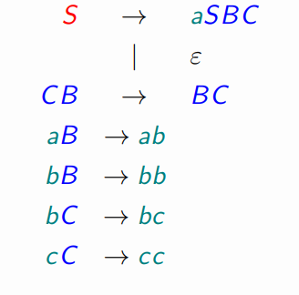

Last edited time: November 6, 2023 3:28 PM

## Find the Grammar for the langauge

**to be double checked**

## EX1

$$
L_2 = \{w ∈ \{a, b \}* \ | \ |w|_a = |w|_b
\}
$$

- ANSWER
    
    $$
    \mathcal{G} = (\{a,b\},  \{ S \rightarrow\begin{cases}  \epsilon \\
    | aX \\ |Xa
    \end{cases} ,  X \rightarrow\begin{cases}  
    | bS \\ |sB
    \end{cases} ,\{ S \} ) 
    $$
    

## EX2

$$
L_1 = {a^nb^m | \ n, m ∈ \mathbb{N},\ m ≥ n}.
$$

- ANSWER
    
    $$
    \mathcal{G} = (\{a,b\},  \{ S \rightarrow\begin{cases}  
    | aSbb \\ |ab \\ |b \\ | \epsilon
    \end{cases} \},\{ S \} ) 
    $$
    

## EX3

$$
\text{Find a monotonic grammar generating :} \\  L = \{a
^nb^
n
c^
n \ 
| \ n ∈ N  \}
$$

- ANSWER
    
    
