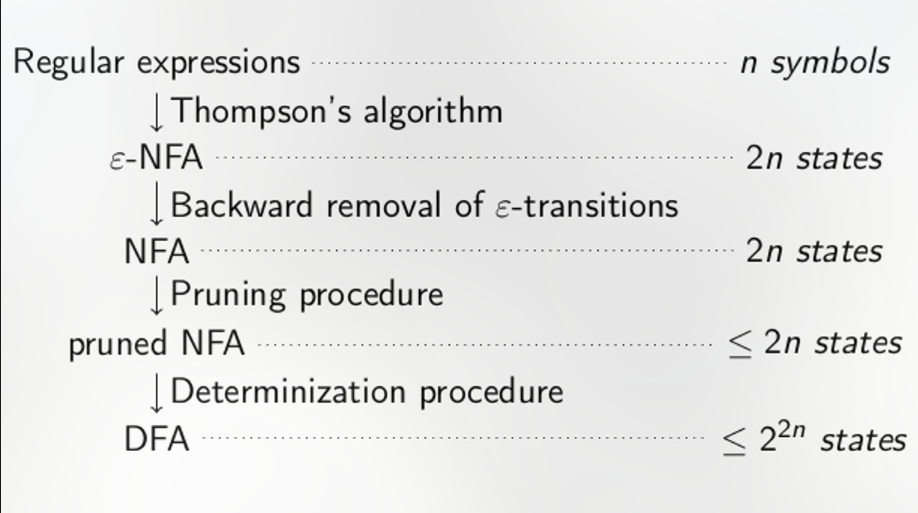

Last edited time: November 12, 2023 10:03 PM

- An alphabet is a **finite** set of letter
- A word is a **finite** set of letter
- The empty word is a world
- A language is a finite or infinite set of word
- The empty language is the language not containing any word

- **decidable / recursive**
    
     algo answers true or false for any words @
    
- **semi-decidable / recursively enumerable**
    
    algo returns true false or never ends
    

<aside>
👉 (DECIDABLE / RECURSIVE) ⊆ (SEMI-DECIDABLE / RECURSIVELY ENUMERABLE)

</aside>

- **rational language / regular**
    - if there exists a regular expression
    - union, concatenation, kleene star
    - (DECIDABLE)
    - to prove not rational use pumping lemma
    
    To a regular expression e ∈ RegΣ, we match a language L(e) inductively
    as follows:
    If e = ∅, L(e) = ∅.
    If e = ε, L(e) = {ε}.
    If e = a for a ∈ Σ, L(e) = {a}.
    If e = e1e2, L(e) = L(e1) · L(e2).
    If e = e1 + e2, L(e) = L(e1) ∪ L(e2).
    If e = e1∗, L(e) = L(e1)*
    
- **completeness**
    
    at every edge there is a one out going edge for each letter of the the alphabet ⇒ **for each word in Σ*, at least one path**
    
- **sink state**
    
    to make complete, once entered cannot leave
    
- **spontaneous transition**
    
    ε, allows us to branch early, using a form of
    non-determinism.
    

## Thompson's:

- . = 1 x ε
- rest =  4 X ε
- take number all symbols ( ε, ∅, +, ∗, and letters in Σ) x 2 for number of states

## Backward removal:

- row for each state
- add all  ε transition end points
- repeat until no change
- all states that include final sates in the tables are final
- backwards removal including multiple  ε and loops

## Pruning:

- useful states
- I ⇒ x is accessible
- x ⇒ F co-accessible

## Determinization

- similar to condensation
- set starts with initial
- table with alphabet
- all sets containing final are final
- don’t forget self loops and sink state goes to sink state with all letters

## Moore's

- Classes
- final and not final sets
- table with alphabet
- label with all parents with each letter
- any parent not in the set we split the class removing all parents for given number
- create a minimal DFA using indistinguishably classes to get canonical automation (Myhill-Nerode)

### Pumping Lemma

- given a rational language, there exists pumping threshold such that any word smaller that PT there are 3 words x,y,z such that and xy*z ⊆ of the language
- can prove by contradiction to show a language is not rational
