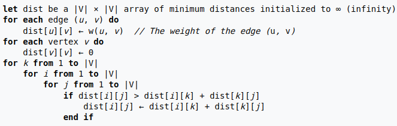

Allow negative cost: Yes
Type of algorithm: Every points to every points
remember: floyd is a cunt

# Principle

<aside>
💡 The floyd algo is similar to [Warshall](../Warshall.md) one

</aside>

# Pseudo code



## Example of applications

### Quick example


### Example of initial matrice


### Final matrice


# Gitlab


# ChatGPT implementation

```python
def floyd(graph):
    # initialize the distance matrix with infinity for all pairs
    dist = [infinity*graph.order for i in range(graph.order)]

    # initialize the diagonal with 0
    for i in range(graph.order):
        dist[i][i] = 0

    # fill the distance matrix with the edge costs
    for i in range(graph.order):
        for j in graph.adjlists[i]:
            dist[i][j] = graph.costs[(i, j)]

    # compute the shortest paths between all pairs of vertices
    for k in range(graph.order):
        for i in range(graph.order):
            for j in range(graph.order):
                if dist[i][k] + dist[k][j] < dist[i][j]:
                    dist[i][j] = dist[i][k] + dist[k][j]

    return dist
```

-
