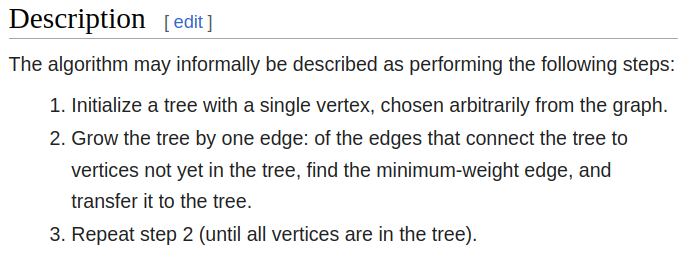

Last edited time: May 7, 2023 2:05 PM

# Description



# Pseudocode


# Example

1.


2.


⬛ = potentials

🟥 = picked

⬜ = either not seen or not considered anymore

3.


4.


# To remember

- initiallize heap, n = 0, parent[-1 ], insol[F ], costs[inf], graph T(undir), x = 0
- inSol[0] = T,
- while n < G.order:
    - check x adjs not in sol, and cost[adj] > G.costs(x,adj)
    - update heap, parent and costs of adj
    - check heap is empty for not connected
    - x = heap.pop(), x now in sol, T.addegde(x, p[x], costs[x]), n++
- return T

# ChatGPT implementation

```python
import sys

def prim(graph, start):
    visited = set()
    mst = set()
    distances = {v: sys.maxsize for v in graph.adjlists}
    distances[start] = 0

    while len(visited) < graph.order:
        min_distance = sys.maxsize
        for v in graph.adjlists:
            if v not in visited and distances[v] < min_distance:
                min_distance = distances[v]
                min_vertex = v

        visited.add(min_vertex)
        for neighbor, cost in graph.adjlists[min_vertex].items():
            if neighbor not in visited and cost < distances[neighbor]:
                distances[neighbor] = cost
                mst.add((min_vertex, neighbor, cost))

    return mst
```
