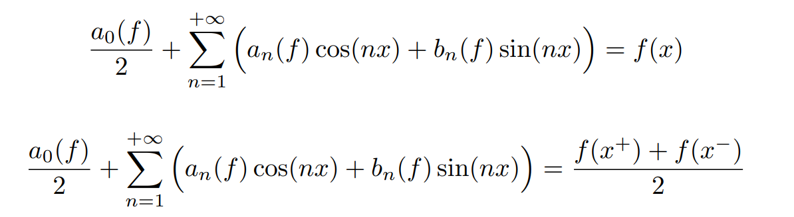

Last edited time: May 5, 2023 6:44 PM

# Definition

If f(x) is a periodic function with period T and has a finite number of maxima and minima over one period, then the Fourier series of f(x) converges point wise to f(x) at every point where f(x) is continuous.

This theorem states that if a periodic function has a finite number of maxima and minima over one period and is continuous at a point, then the Fourier series of the function converges to the value of the function at that point.

<aside>
🔑 reminder: when we use this theorem, we must start that f is piece-wise of C^1

</aside>

Written as an expression:

# Exercises

[Ex03securise.pdf](Parseval%20Theorem/Ex03securise.pdf)

## Correction


Correction

[CorEx03securise.pdf](Parseval%20Theorem/CorEx03securise.pdf)
