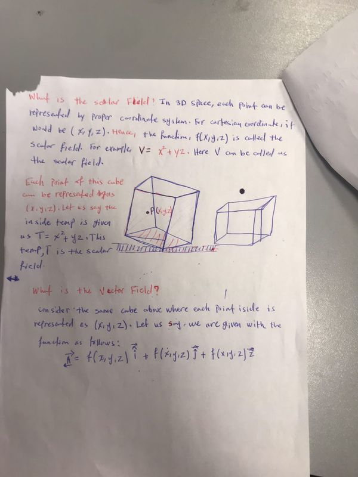

Last edited time: April 17, 2023 2:40 AM

# Field

it is the same as a function in mathematics but applied to vectors

A field is a function that takes 3 parameters (x, y, z) and returns and gives a scalar values

<aside>
💡 It is mostly used as a potential v

</aside>

## Example

$$
f(x,y,z) = 2x^2 - 3xy + 4yz - z^3

$$

