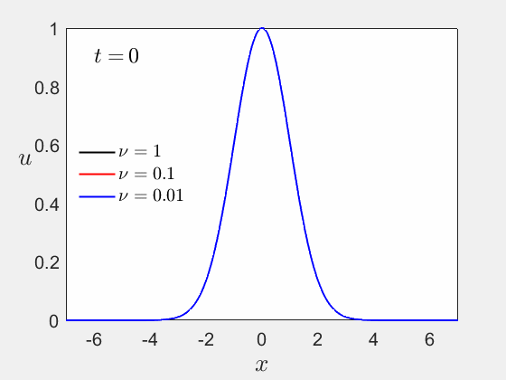

## Control volume

A control volume is a small, finite region in space (a cell) over which the governing equations of fluid flow (mass, momentum, and energy conservation) are applied.
The domain is divided into many such control volumes (**cells**) that makes up a **mesh**. These cells are typically `quadrangles & triangles` in **2D** and `cuboid & thetraedra & pyramid...` in **3D**.
> [!important] a cell is also called Control Volume
Each cell assumes to have:
* A [centroid](https://en.wikipedia.org/wiki/Centroid)
* Some edges (a node in 1d, a bar in 2d, polygons in 3d)
The equations are integrated over each CV, ensuring conservation laws hold locally.

### Definition of a scalar field in a mesh

Since we have several cells, we discretize the field by having each cell holding one single value.
The difficulty resides in the interpolation of the field value between the centroid and the edge of the cell. Some common approaches consider the function linear between each cell centroid. This simplifies a lot the math part of the solution and let the user decide on the precision required when doing the actual computation by defining more or less large cells.

## Rate of mass flow in a control volume

The rate of mass flow (or mass flow rate) of a control volume is a measure of how much mass enters or exits the volume per unit time.

The mass flow of $\dot{m}$ (a face of a control volume) is given by:
$$
\dot{m} = \rho \cdot A \cdot V
$$
where:
* $\rho$ = fluid-density
* $A$ = cross-sectional area through which the fluid flows (m²)
* $V$ = average velocity of the fluid normal to the area (m/s)

In the context of a cell, it is given by:

$(\rho u + \frac{\delta}{\delta \vec{n}} (\rho u) \frac{\delta x}{2}) A$ 

If mass enters the volume, the mass flow is positive, otherwise, it is negative.

## Definitions

### Convection
Convection is the movement of fluid (liquid or gas) that transfers heat, mass, or momentum from one place to another.
$$
\frac{\partial (\rho \phi)}{\partial t} + \nabla \cdot (\rho \phi \mathbf{u}) = \text{Other terms (diffusion, sources)}
$$

where:

-   $\rho$ = density
    
-   $\mathbf{u}$ = velocity vector (convective transport)
    
-   $\phi$ = transported scalar (momentum component, temperature, species mass fraction, etc.)

The PDE governing linear convection in 2D is written as:
$$\frac{\partial u}{\partial t}+c\frac{\partial u}{\partial x} + c\frac{\partial u}{\partial y} = 0$$
    
## Courant–Friedrichs–Lewy condition

The principle behind the condition is that, for example, if a wave is moving across a discrete spatial grid and we want to compute its amplitude at discrete time steps of equal duration, then this duration must be less than the time for the wave to travel to adjacent grid points.

Assuming a nonlinear convection $\frac{\partial u}{\partial t} + u \frac{\partial u}{\partial x} = 0$.
Then, using a forward step difference in time and a backward step difference in space: $\frac{u_i^{n+1}-u_i^n}{\Delta t} + u_i^n \frac{u_i^n-u_{i-1}^n}{\Delta x} = 0$.
And solving the only unkown term $u^{n+1}_i$ yield: $u_i^{n+1} = u_i^n - u_i^n \frac{\Delta t}{\Delta x} (u_i^n - u_{i-1}^n)$.

A term $\sigma = u_i^n\frac{\Delta t}{\Delta x}$ appears. The CFL condition says that $\Delta t \leq \frac{C \Delta x}{u_i^n}$ where $C$ is the courant number (typically $C \leq 1$ for stability)
The maximum CFL number $\sigma_{\text{max}}$ is the largest value of $\sigma$ that still ensures numerical stability.
$\sigma = \frac{u_{max}^n \Delta t}{\Delta x}$

Please [check this out](https://nbviewer.org/github/barbagroup/CFDPython/blob/master/lessons/03_CFL_Condition.ipynb) for clearer visuals.

## Diffusion in 1D

The one-dimensional diffusion is:
$$
\frac{\partial u}{\partial t}= \nu \frac{\partial^2 u}{\partial x^2}
$$

Using taylor expansion of $u_{i+1}$ and $u_{i-1}$ around $u_i$:
$$
u_{i+1} = u_i + \Delta x \frac{\partial u}{\partial x}\bigg|_i + \frac{\Delta x^2}{2} \frac{\partial ^2 u}{\partial x^2}\bigg|_i + \frac{\Delta x^3}{3!} \frac{\partial ^3 u}{\partial x^3}\bigg|_i + O(\Delta x^4)
$$
$$
u_{i-1} = u_i - \Delta x \frac{\partial u}{\partial x}\bigg|_i + \frac{\Delta x^2}{2} \frac{\partial ^2 u}{\partial x^2}\bigg|_i - \frac{\Delta x^3}{3!} \frac{\partial ^3 u}{\partial x^3}\bigg|_i + O(\Delta x^4)
$$

If we add those 2 expansions: $u_{i+1} + u_{i-1} = 2u_i+\Delta x^2 \frac{\partial ^2 u}{\partial x^2}\bigg|_i + O(\Delta x^4)$
Then rearrange to solve for $\frac{\partial ^2 u}{\partial x^2}\bigg|_i$:
$$
\frac{\partial ^2 u}{\partial x^2}=\frac{u_{i+1}-2u_{i}+u_{i-1}}{\Delta x^2} + O(\Delta x^2)
$$
We can now write the discretized version of the diffusion equation in 1D:
$$
\frac{u_{i}^{n+1}-u_{i}^{n}}{\Delta t}=\nu\frac{u_{i+1}^{n}-2u_{i}^{n}+u_{i-1}^{n}}{\Delta x^2}
$$

## Burger Equation
General form:
$$
{\displaystyle {\frac {\partial u}{\partial t}}+u{\frac {\partial u}{\partial x}}=\nu {\frac {\partial ^{2}u}{\partial x^{2}}}.}
$$
Where $\nu$ is the difusion term.
As you can see, it is a combination of non-linear convection and diffusion.
Using forward difference for time, backward difference for space and our 2nd-order method for the second derivatives yields:
$$\frac{u_i^{n+1}-u_i^n}{\Delta t} + u_i^n \frac{u_i^n - u_{i-1}^n}{\Delta x} = \nu \frac{u_{i+1}^n - 2u_i^n + u_{i-1}^n}{\Delta x^2}$$
$$u_i^{n+1} = u_i^n - u_i^n \frac{\Delta t}{\Delta x} (u_i^n - u_{i-1}^n) + \nu \frac{\Delta t}{\Delta x^2}(u_{i+1}^n - 2u_i^n + u_{i-1}^n)$$

Solutions of the [Burgers](https://en.wikipedia.org/wiki/Burgers%27_equation) equation starting from a Gaussian initial condition:

## Resources

* http://www.scholarpedia.org/article/Finite_volume_method
* https://www.math.uci.edu/~chenlong/226/FVM.pdf
* https://nbviewer.org/github/barbagroup/CFDPython/tree/master/lessons/
